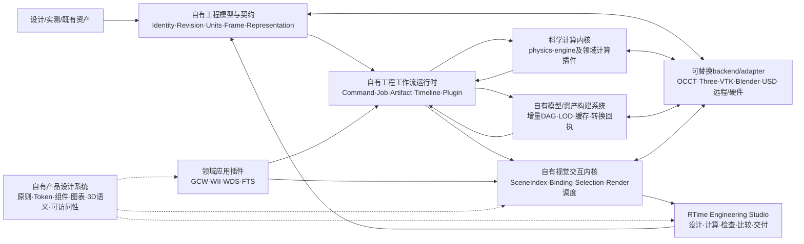

# 架构与数据流入口

状态：**现状索引+上位平台提案路由，2026-08-09**。本页不冻结新接口，也不声明平台、
模型资产系统、Studio或外部适配器已经实现。

现有[spec/01](spec/01_模块地图与域划分_v0.md)主要描述`physics-engine`仓内依赖；
新[platform/](platform/README.md)描述GCW、WII、WDS、FTS共同指向的
**产品级工程设计与计算平台**。
两张图回答的问题不同，必须同时看。

## 一、`physics-engine`仓内依赖图（现行）

```text
呈现与交互目标圈
        ↓
物理域
        ↓
资产/场景基座
        ↓
契约、溯源与治理
```

依赖只向下；物理域互不import；跨域组合发生在库外；`physics-engine`不反向依赖GCW、
WII、WDS、FTS或未来Studio。细则以[spec/01](spec/01_模块地图与域划分_v0.md)和
[spec/15](spec/15_物理域边界与跨域耦合_v0.md)为正本。

这张图不等于“所有产品能力都应进入Python wheel”。当前包仍是无头、零必需运行时依赖的
科学计算内核；浏览器、工作区、CAD、DCC和重型图形依赖不进入`src/physics_engine/`。

## 二、RTime工程设计与计算平台产品图（新增提案）



图A-1 自有平台闭环；Studio产生新草案/revision和新job，不回写篡改已完成run。

平台不是一条“算完→交给Blender”的输出管线。我们自己拥有工程对象、任务、结果、
工作区与视觉运行时；外部软件只在adapter边界执行具体CAD、绘制、科学可视化、离线渲染或
格式交换。完整边界见[platform/01](platform/01_自有工程设计与计算平台总体架构_20260809.md)，
前端细化见[platform/02](platform/02_前端运行时与Studio架构_20260809.md)。

## 三、现行与拟议所有权

| 责任 | 今天的权威/种子 | 证据状态 | 拟议归属 | 不得发生 |
|---|---|---|---|---|
| 数学、状态、求解与物理结果 | `physics-engine`及领域计算代码 | 已实现但能力有诚实缺口 | 科学计算内核 | Studio、renderer或Blender重算物理 |
| 制造级几何 | GCW/CAD/STEP-B-Rep上游 | 已有上游权威 | 上游权威；平台只登记和派生 | GLB/STL反向冒充制造真源 |
| 工程对象与多表示关系 | 各仓局部清单 | 局部实现，尚未统一 | 自有工程模型/契约内核 | 外部格式成为唯一对象模型 |
| 工程会话、任务和制品 | 各仓生命周期；FTS Provider草案 | 生命周期分散；FTS面为未接线草案 | 自有工程工作流运行时 | UI直接认Python对象/路径或伪造complete |
| 时间、帧与场 | WII轨道、WDS FramePacket、FTS数组 | 各自已用，语义不同 | 公共时间机制+领域政策 | 通用插值器补造证据帧 |
| 工作区、Widget和数据绑定 | FTS workspace草案等局部实现 | 草案/局部实现 | 自有Studio/工作台内核 | workspace state污染run package |
| 在线视觉运行 | GCW/FTS Three、WDS WebGL2 | 各仓已有，未形成公共runtime | 自有SceneIndex/runtime+多backend | 公共API暴露Three/WebGL对象 |
| 设计系统与产品美学 | FTS工业主题方向、四仓局部样式 | 分散，未形成自有规范 | 自有原则/token/组件/科学图表/3D语义 | 把第三方主题或品牌色当平台设计语言 |
| 资产转换、LOD、动画烘焙 | 各仓脚本与人工流程 | 分散/人工，未形成系统 | 平台模型/资产构建子系统 | 浏览器启动时临时做重型CAD转换 |
| 离线渲染和生态交换 | 零散或待建 | 大多未实现 | Blender/USD/VTK等adapter | `.blend`、USD或VTK成为总真源 |
| 数值/资产/渲染硬件 | CPU基线与局部实现 | 仅局部后端和研究证据 | 三个独立backend registry | 一个“GPU开关”暗改精度和语义 |

## 四、旧口径冲突

[spec/00](spec/00_统一接口规范_总纲_v0.md)第三节曾显式排除“统一前端栈”。最新用户意图
要求统一的不是所有renderer实现，而是**前端运行时、资源生命周期、工作区、交互和插件
接口**；GCW的CAD picking、WDS的证据帧、WII的FK绑定和FTS的光学布局仍归领域插件。

本页登记该冲突，不修改旧spec。进入实现前必须由新决策记录给出取代口径，避免研究页静默
改变冻结范围。

## 五、按任务读哪份文档

- 先理解“这段时间到底要建设什么”：读[platform/README](platform/README.md)和
  [platform/00](platform/00_平台愿景与用户意图_20260809.md)。
- 改产品模块、契约或链路：读
  [platform/01](platform/01_自有工程设计与计算平台总体架构_20260809.md)。
- 改前端工作区、SceneIndex、renderer、timeline或美学：读
  [platform/02](platform/02_前端运行时与Studio架构_20260809.md)和
  [platform/04](platform/04_产品设计系统与美学规范_20260809.md)。
- 决定首个纵切、仓库或实施阶段：读
  [platform/03](platform/03_演进路线与仓库边界_20260809.md)；涉及迁移`physics-engine`
  或修改相关项目时再读[platform/05](platform/05_仓库迁移与相关项目改造方案_20260809.md)。
- 改多表示资产、模型替换、动画格式或硬件专项：读
  [research/14](research/14_多表示模型资产与硬件适配架构_20260809.md)与
  [plans/10](plans/10_模型资产与呈现架构演进计划_20260809.md)；二者是平台子系统资料。
- 改物理域、精度或`physics-engine`包内依赖：仍读spec/01、spec/13、spec/15和当前决策。
- 改当前物理开发优先级：仍以[plans/09](plans/09_交接_20260806.md)和
  [plans/08](plans/08_子系统补充计划_20260806.md)为准；平台提案没有自动改写它们。
