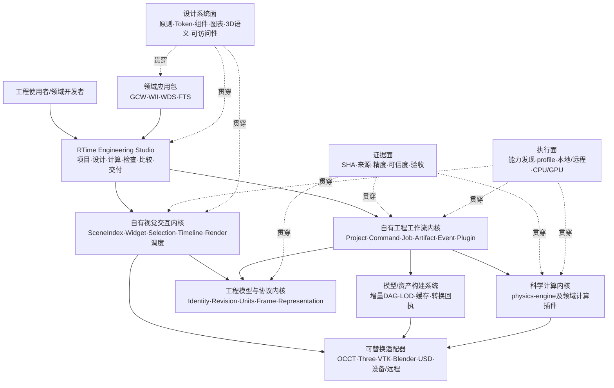

# 自有工程设计与计算平台总体架构（2026-08-09）

状态：**产品级候选架构，未冻结、未落码**。本页划分项目模块、链路、契约和关系；
`physics-engine`包内边界仍以现行spec和治理测试为准。

## 一、总形态：四个内核、一个Studio、三条横切面



图P-1 自有平台产品拓扑；箭头表示调用或数据流，不表示所有模块必须同仓。

四个内核分别拥有不同真值：

- **工程模型与协议内核**拥有对象身份、revision、装配、单位、坐标和多表示关系；
- **科学计算内核**拥有物理定义、数值结果、适用域、精度与确定性；
- **工程工作流内核**拥有项目会话、命令、作业、制品、时间和插件生命周期；
- **视觉交互内核**拥有视图投影、资源、选择、时间同步与呈现调度；
- **Studio**拥有产品工作流和用户状态，但不拥有物理真值。

设计系统不是第五个求解内核，而是贯穿Studio、视觉运行时、领域插件、报告和导出的一等
产品协议。它决定相同语义如何被看见、操作和验证，不等于某套CSS主题。

## 二、项目层面的十个大模块

| 模块 | 自有责任 | 不负责 | 首批种子 |
|---|---|---|---|
| 1契约与可信度基础层 | ID、schema/version、单位、frame、时间、SHA、来源、证据、兼容 | 领域方程、UI布局 | `physics-engine`七轴、facet、canonical、run package |
| 2工程模型内核 | Entity/Component/Assembly/Port/Parameter/Revision/Representation关系 | CAD内核和renderer对象 | FTS组件/端口、WII模型清单、GCW语义选择 |
| 3科学计算内核 | 物理域、状态、物理律、耦合、求解器、积分器、诊断 | 工作区和绘制 | 当前`physics-engine`与领域计算代码 |
| 4工程工作流运行时 | project/session、command、job、event、artifact、timeline、cache、plugin | 偷算领域物理 | FTS ComputeProvider草案、各仓run生命周期 |
| 5视觉交互内核 | renderer-neutral SceneIndex、binding、selection、camera、LOD、dirty update | 领域picking裁决、shader物理语义 | `viewport-input`、WDS资源生命周期、FTS/GCW Three实践 |
| 6Studio工作台 | 项目树、检查器、参数草案、作业、视口、图表、比较、导出 | 不可变run内部改写 | FTS workspace草案和工业工作台方向 |
| 7模型与资产构建 | CAD/网格/碰撞/LOD/动画派生、内容DAG、原子发布 | 把派生产物冒充真源 | research/14四项目表示清单 |
| 8产品设计系统 | 原则、视觉语言、token、组件、图表/3D语义、动效、内容和可访问性 | 物理状态裁决、品牌色冒充科学色表 | FTS工业主题方向、四项目交互经验 |
| 9插件与适配SDK | 领域插件、compute/render/asset/export adapter、能力协商 | 第三方类型进入核心 | 四项目现有适配边界 |
| 10部署与产品治理 | Web/桌面/headless/本地服务、离线包、许可、安全、性能和升级 | 以云或特定GPU为前置 | 单机优先、跨平台和30/120纪律 |

“通用”发生在1、2、4、5、6、8、9的稳定机制；领域方程、布局、判据和专用呈现通过插件保留，
不因进入同一产品而被强行同质化。

模块1是横切的协议/可信度基础，模块1+2共同组成前图中的“工程模型与协议内核”；它不额外
增加第五个产品内核。十个模块是代码与治理责任拆分，四个内核是产品级真值边界，计数口径不同。

## 三、数值求解到底位于哪里

数值求解不是“前端点一下得到数字”，而是科学计算内核中的一条可审计链：

```text
场景revision+参数revision
→物理状态/参考/上下文
→离散的能量、残差、约束或演化方程
→显式选择的求解器/积分器及精度策略
→收敛、稳定性、误差和失败诊断
→不可变结果、帧/场数据与run package
```

数学问题的定义与求解后端必须分开。CPU参考、NumPy/BLAS、编译CPU或CUDA可以是不同执行
实现，但不得静默改变方程、float64口径、时间步或收敛判据。Studio只提交参数化作业并消费
结果；renderer和Blender不得重算FK、接触、OPD或其他物理量。

## 四、十二类契约，不等于十二个facet

| 契约族 | 回答的问题 | 主要所有者 | 何时需要稳定落盘 |
|---|---|---|---|
| C1身份与revision | 这是哪个对象、哪一版 | 契约/工程模型 | 跨进程、跨仓、缓存或发布时 |
| C2单位、frame与时间 | 数值在哪个量纲、坐标和时基中 | 契约内核 | 所有跨边界数值 |
| C3工程对象与装配 | 实体、组件、端口怎样组合 | 工程模型 | 项目/场景文件 |
| C4参数与草案 | 哪些输入可编辑、默认/约束/来源是什么 | 工程模型+领域插件 | 保存设计或发起作业时 |
| C5多表示与派生 | design/physics/collision/render等怎样关联 | 工程模型+资产系统 | 资产清单与转换回执 |
| C6物理模型 | 采用什么方程、材料、边界和适用域 | 科学内核 | 场景物理声明与run输入 |
| C7作业与执行计划 | 调什么能力、状态、取消/恢复如何表达 | 工程工作流运行时 | 跨线程/进程/机器时 |
| C8后端与能力 | 精度、确定性、资源和限制是什么 | 执行面+具体内核 | 选择后端和发布结果时 |
| C9帧、轨道与场 | 状态怎样随时间或空间变化 | 工作流运行时+领域插件 | 流式/落盘结果 |
| C10run与诊断 | 一次计算输入、输出、状态和失败如何闭包 | 科学内核+运行时 | 每个正式run |
| C11command/event/plugin | 用户动作、事务和扩展怎样协作 | 工作流运行时/Studio | 需要重放、迁移或跨进程时 |
| C12view/interaction | 视图、binding、selection和工作区怎样表达 | 视觉内核/Studio | 保存workspace或跨插件时 |

只有跨信任边界的稳定字节形制才进入`engine_facets.py`一类facet清册。必须区分：

- **facet**：跨仓/跨进程/落盘的版本化字节面；
- **API**：同一进程内的调用接口；
- **数学协议**：能量、残差、Jacobian、积分器等科学关系；
- **UI状态**：用户本地工作区、选择和相机；
- **adapter ABI**：外部工具或backend的接入边界。

把所有内部类都叫“契约”会造成冻结泛滥；完全不冻结跨边界字节又会造成项目漂移。

### 4.1 跨语言schema不能双写两份正本

平台进入P1前应确定“**一个字节面只有一个权威schema**”：

- 已由`physics-engine`发布的facet/run package继续以本仓现行规范和facet版本为权威；
  TypeScript侧通过生成类型或固定fixture/conformance test消费，不另抄一份“相似协议”；
- workspace、通用job envelope、SceneIndex change set等平台新面由平台仓拥有版本与迁移；
- 四领域插件只拥有自己的扩展schema，通过命名空间挂接，不向公共core塞领域枚举；
- Python、TypeScript或其他语言实现都必须对同一canonical fixture做接受/拒绝对拍；
- 若某个字段同时出现在科学facet和平台协议中，必须采用引用/适配而非两个团队分别定版本。

具体使用JSON Schema、IDL还是手写validator要在首个纵切上评测后决定；“先各写一份以后同步”
不是候选方案。

## 五、九类关系比“模型互转”更准确

| 关系 | 含义 | 例子 | 必须守住的规则 |
|---|---|---|---|
| authority | 谁是某类真值 | STEP是制造权威，run是仿真结果权威 | 派生产物不得反向夺权 |
| identity | 多份数据是否指同一逻辑对象 | 机器人link的CAD、碰撞、显示表示 | `subject_id`稳定，revision明确 |
| composition | 对象怎样装配 | FTS组件—端口—光路，机器人link—joint | 层级与端口有类型/约束 |
| derivation | 一个表示怎样有向生成另一个 | STEP→GLB、run→动画缓存 | recipe、工具版本、误差和SHA入回执 |
| binding | 不同数据怎样绑定而不互转 | run中的body_id绑定显示node | 单位/frame/time必须一致 |
| execution | 哪个实现执行哪个任务 | physics provider、asset worker | 显式能力与失败关闭 |
| observation | 结果怎样成为图、场或诊断 | 光谱数组绑定plot Widget | 显示不修改物理结果 |
| control | 用户动作怎样生成新状态 | 参数编辑→新draft→新job | 不直接改已完成run |
| adaptation | 平台怎样与工具/格式互操作 | Blender、VTK、URDF adapter | 外部类型止步adapter边界 |

## 六、六条链路构成闭环

### 6.1 模型创作链

```text
CAD/参数/实测/既有资产→导入验证→自有工程模型图→场景/参数草案→新revision
```

### 6.2 表示构建链

```text
工程模型图→表示规划→CAD/网格/材质/碰撞/LOD编译→资产清单与缓存→运行表示
```

### 6.3 仿真计算链

```text
场景revision+参数revision→物理定义→数值执行→诊断→不可变run package
```

### 6.4 工作台交互链

```text
用户command→草案/能力校验→ComputeProvider→job→已验证artifact→Widget binding
```

### 6.5 呈现与分析链

```text
工程模型+run→自有SceneIndex/数据通道→3D/曲线/场/比较Widget→renderer backend
```

### 6.6 外部生态链

```text
平台协议↔adapter↔Blender/OCCT/VTK/机器人格式/第三方计算软件
```

这些链路由证据面和执行面贯穿。它们不是一条“算完后交给Blender”的单向流水线；用户在
Studio检查结果后可以生成新的参数revision和作业，但不能回写篡改旧run。

## 七、仓内依赖与产品拓扑必须分开

现行[spec/01](../spec/01_模块地图与域划分_v0.md)继续约束`physics-engine`包内依赖；
现行[spec/15](../spec/15_物理域边界与跨域耦合_v0.md)继续要求物理域和耦合是包内叶子。
平台运行时是**包外编排者**，通过公开端点、Provider和run package组合领域，不让
Studio直接import求解器内部对象。

旧[spec/00](../spec/00_统一接口规范_总纲_v0.md)第三节写着“前端栈不统一”。最新方向与它
存在范围冲突，推荐的正式修订口径是：

> 统一前端运行时、资源生命周期、工作区、交互和插件接口；不强制统一领域renderer实现、
> shader、业务picking和领域视觉语义。

本页只登记冲突与建议，不直接修改旧spec。若进入实现，应以新决策记录明确取代旧口径。

## 八、行业架构给出的可复用原则

- NVIDIA Omniverse Kit采用最小内核管理扩展、事件、更新和设置，应用由版本化扩展组合；
  可借鉴“薄内核+扩展”，不意味着引入Kit作为产品依赖：
  https://docs.omniverse.nvidia.com/kit/docs/kit-manual/106.5.0/guide/kit_architecture.html
- OpenUSD Hydra 2把场景抽象/变换管线与renderer抽象/执行管线分开，并通过Scene Index的
  added/removed/dirtied通知传播变化；这支持我们自有SceneIndex+render delegate边界：
  https://openusd.org/dev/api/_page__hydra__getting__started__guide.html
- VTK把data object、process object和execution strategy分开，支持按需执行、分块和流式；
  这支持把数据、算法和调度拆开，而不是让Widget每次全量重算：
  https://book.vtk.org/en/latest/VTKBook/04Chapter4.html

这些是架构模式证据，不是“直接采用整套产品”的结论。我们的语义和工作流来自四个真实
项目，不能由任何单一行业框架反向定义。
